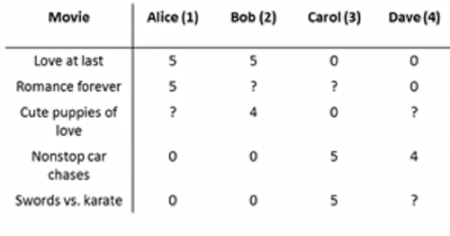

# js-recommender
Package provides java implementation of content collaborative filtering for recommend-er system

[](https://travis-ci.org/chen0040/js-recommender) [](https://coveralls.io/github/chen0040/js-recommender?branch=master) 

# Install

```bash
npm install js-recommender
```

# Usage 

The the direct use of the javascript in html can be found in [example.html](https://rawgit.com/chen0040/js-recommender/master/example.html).

The sample code below tries to predict the missing rating of [user, movie] as shown in the table below:



```javascript
var jsrecommender = require("js-recommender");

var recommender = new jsrecommender.Recommender();
      
var table = new jsrecommender.Table();

  // table.setCell('[movie-name]', '[user]', [score]);
table.setCell('Love at last', 'Alice', 5);
table.setCell('Remance forever', 'Alice', 5);
table.setCell('Nonstop car chases', 'Alice', 0);
table.setCell('Sword vs. karate', 'Alice', 0);
table.setCell('Love at last', 'Bob', 5);
table.setCell('Cute puppies of love', 'Bob', 4);
table.setCell('Nonstop car chases', 'Bob', 0);
table.setCell('Sword vs. karate', 'Bob', 0);
table.setCell('Love at last', 'Carol', 0);
table.setCell('Cute puppies of love', 'Carol', 0);
table.setCell('Nonstop car chases', 'Carol', 5);
table.setCell('Sword vs. karate', 'Carol', 5);
table.setCell('Love at last', 'Dave', 0);
table.setCell('Remance forever', 'Dave', 0);
table.setCell('Nonstop car chases', 'Dave', 4);

var model = recommender.fit(table);
console.log(model);

predicted_table = recommender.transform(table);

console.log(predicted_table);


for (var i = 0; i < predicted_table.columnNames.length; ++i) {
    var user = predicted_table.columnNames[i];
    console.log('For user: ' + user);
    for (var j = 0; j < predicted_table.rowNames.length; ++j) {
        var movie = predicted_table.rowNames[j];
        console.log('Movie [' + movie + '] has actual rating of ' + Math.round(table.getCell(movie, user)));
        console.log('Movie [' + movie + '] is predicted to have rating ' + Math.round(predicted_table.getCell(movie, user)));
    }
}
```

To configure the recommender, can overwrite its parameters in its constructor:

```javascript
var recommender = new jsrecommender.Recommender({
    alpha: 0.01, // learning rate
    lambda: 0.0, // regularization parameter
    iterations: 500, // maximum number of iterations in the gradient descent algorithm
    kDim: 2 // number of hidden features for each movie
});
```